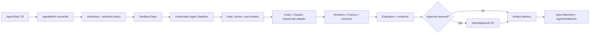

# Kubernetes AI Agent Operator

## AgentMesh Operator

**Kubernetes operator for AI agents, MCP, A2A, Agent Sandbox, Azure AKS, Terraform automation, OpenTelemetry, DevSecOps and AI FinOps.**

AgentMesh Operator reconciles an `AgentTask` from business intent to an approval-aware, evidence-producing execution lifecycle. It sits above [Kubernetes Agent Sandbox](https://agent-sandbox.sigs.k8s.io/): Agent Sandbox owns isolated workspace lifecycle; AgentMesh owns task admission, authority, economics, evidence and outcome state.

```text
AgentTask
  -> policy and budget admission
  -> SandboxClaim intent
  -> agent execution
  -> evaluation and approval pause
  -> delivery
  -> evidence receipt and cleanup
```

> **Claim boundary:** v0.1 contains an executable Go reconciliation kernel, CRD contracts, current Agent Sandbox `v1beta1` manifests, Helm packaging, policy examples and deterministic tests. The included CLI simulates reconciliations against JSON state; it is not yet a controller-runtime process watching a live cluster. AKS, workload identity, Key Vault, Temporal and external agent adapters remain deployment contracts until exercised and evidenced.

## Run the lifecycle locally

```bash
go test ./...
go run ./cmd/agentmesh-operator simulate examples/azure-private-endpoint-task.json --output generated
```

The simulation performs idempotent reconciliation until the task reaches `AwaitingApproval`. It emits:

- `task-status.json`
- `sandboxclaim.yaml`
- `evidence-receipt.json`
- `executive-report.md`

Expected state:

```text
Pending → Admitted → SandboxProvisioning → Running → Evaluating → AwaitingApproval
```

The task cannot progress to delivery without an approval bound to its task ID, capability, artifact digest and policy version.

## Why this exists

Coding agents can create changes faster than enterprises can safely allocate infrastructure, constrain authority, recover failures and prove outcomes. A shell session or remote workspace does not provide a durable business lifecycle.

AgentMesh Operator adds:

- workload-aware isolation placement;
- technically explicit allowed, approval-required and denied capabilities;
- pre-allocation budget enforcement;
- idempotent reconciliation after controller restarts;
- artifact-bound approvals;
- status conditions suitable for GitOps and automation;
- evidence and cost attribution per accepted outcome.

## Architecture



## CRDs

### `AgentTask`

Declares objective, acceptance criteria, capabilities, data class, tenant trust, isolation, budget, deadline, context references and idempotency key.

### `AgentApproval`

Binds an approver and expiry to a specific task, capability, artifact digest and policy version. Changing the plan invalidates the approval.

### `AgentRuntimeProfile`

Maps workload requirements to RuntimeClass, SandboxTemplate, workload identity, resource ceilings and retention.

### `AgentEvidence`

Records task state, artifacts, evaluations, approvals, costs and a canonical receipt hash.

## Implemented state machine

| Phase | Reconciler responsibility |
|---|---|
| `Pending` | Validate contract, authority and budget |
| `Admitted` | Select isolation profile and agent adapter |
| `SandboxProvisioning` | Emit idempotent `SandboxClaim` intent |
| `Running` | Record bounded execution intent and artifact digest |
| `Evaluating` | Verify acceptance evidence and hard gates |
| `AwaitingApproval` | Stop until an exact, unexpired approval exists |
| `Delivering` | Publish the approved artifact once |
| `Succeeded` | Seal evidence and schedule cleanup |

Terminal failures include `PolicyRejected`, `BudgetExceeded`, `SandboxFailed`, `AgentFailed`, `EvaluationFailed`, `ApprovalExpired` and `DeliveryFailed`.

## Ecosystem

- [AgentMesh Gateway](https://github.com/AAH20/ai-agent-runtime-gateway) defines portable task and authority plans.
- [AgentFabric](https://github.com/AAH20/self-hosted-ai-agent-infrastructure-platform) defines isolation and economic placement.
- [AgentInfraBench](https://github.com/AAH20/ai-agent-infrastructure-benchmark) evaluates implementation evidence.
- Azure AKS, Azure Workload Identity, Key Vault, Azure Monitor, Terraform and GitHub OIDC form the initial cloud reference architecture.

## Distribution

- Helm chart and CRDs
- GHCR controller image contract
- Local simulator requiring only Go
- Terraform/Bicep deployment roadmap
- Agent Sandbox upstream-example candidate
- AgentInfraBench adapter

See [architecture](docs/architecture.md), [AKS production path](docs/azure-aks.md), [unit economics and KPIs](docs/unit-economics.md) and [upstream strategy](docs/upstream.md).

## Call to action

Run the Azure infrastructure-change lifecycle, review the evidence contract and propose an executor or cloud adapter. For enterprise implementation and managed operation, visit [A2Z SOC](https://a2zsoc.com/).

## License

Apache-2.0.
